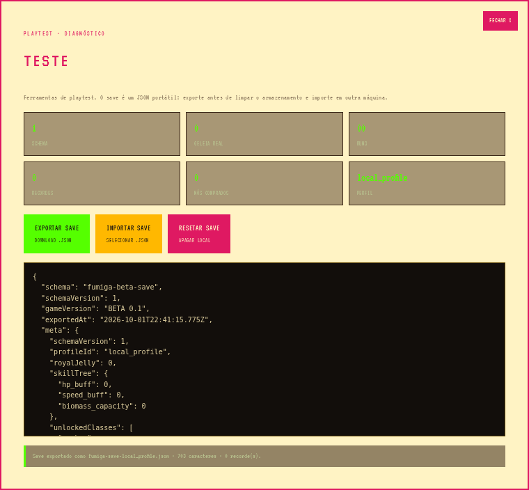
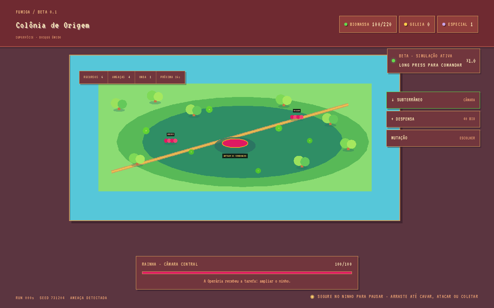

# PLAYTEST — protocolo, aba TESTE e cobertura automática

Este documento descreve como playtestar o Beta 0.1, o que a aba **TESTE** do menu faz,
como os testes são executados e por que eles não dependem de timing.

## Comandos

| Comando         | O que faz                                                                    |
| --------------- | ---------------------------------------------------------------------------- |
| `pnpm check`    | TypeScript estrito em `client/`, `server/`, `shared/` e `tests/`              |
| `pnpm test`     | Testes de unidade (Vitest, ambiente Node) — save, meta, recordes              |
| `pnpm build`    | Bundle do client + server                                                     |
| `pnpm test:ui`  | Teste de UI em navegador real: aba TESTE, exportação, importação, gameplay     |

O teste de UI precisa do bundle no ar; se `dist/public/index.html` não existir ele roda
`pnpm build` sozinho e depois sobe `vite preview` na porta 4173 (override: `FUMIGA_UI_PORT`).

Navegador usado pelo `pnpm test:ui`, nesta ordem:

1. `PLAYWRIGHT_CHROMIUM_PATH` (caminho explícito de um Chromium/Chrome);
2. `@sparticuz/chromium` (devDependency, para ambientes sem CDN de navegador);
3. Chromium instalado por `npx playwright install chromium`.

## Aba TESTE (menu principal → TESTE)

Painel de diagnóstico do playtester, com o estado real do armazenamento local:

- **Leituras**: schema do save, Geleia Real, runs, recordes salvos, nós comprados e perfil.
- **EXPORTAR SAVE**: gera `fumiga-save-<perfil>.json` por download e mostra o mesmo JSON
  na tela (`data-testid="test-preview"`), para conferir sem abrir o arquivo.
- **IMPORTAR SAVE**: lê um `.json` selecionado, valida e substitui a progressão local.
- **RESETAR SAVE**: apaga meta, recompensas e recordes do `localStorage`.

### Formato do save

```jsonc
{
  "schema": "fumiga-beta-save",   // obrigatório; outro valor é recusado
  "schemaVersion": 1,             // maior que o suportado é recusado
  "gameVersion": "BETA 0.1",
  "exportedAt": "2026-10-01T00:00:00.000Z",
  "meta": { /* MetaProgression sanitizada */ },
  "records": [ /* até 5 recordes, ordenados por pontuação */ ]
}
```

A importação nunca confia no arquivo: `sanitizeMeta`/`sanitizeRecords`
(`client/src/game/beta/SaveManager.ts`) removem campos de tipo errado, `NaN`, negativos e
recordes sem `runId`. Um arquivo recusado não altera o save atual — a aba mostra o motivo
em `data-testid="test-status"`.

## Captura da aba TESTE



A imagem é gerada pelo próprio teste de UI (`pnpm test:ui`), que abre o menu, entra na aba
TESTE, exporta o save e grava o recorte do diálogo em `docs/screenshots/test-tab.png`.
Ou seja: a captura é sempre o estado real da build testada, nunca um mock.



O `pnpm test:ui` também grava `docs/screenshots/gameplay.png` ao iniciar a run, para conferir
que a colônia (rainha, formigas, nós de biomassa, inimigos) renderiza de verdade.

### Fallback procedural de sprites

As spritesheet PNG vivem no storage externo (`/manus-storage/…`, ver `constants.ts`) e não
estão neste repositório — o mesmo vale para o build de APK. Sem tratamento, o Phaser falhava o
load e a cena podia quebrar. `BetaGameScene.ensureSpriteTextures()` detecta toda textura
ausente em `create()` e gera uma spritesheet procedural com a **mesma grade de frames**
(8×3: idle 0-7, walk 8-15, carry/ability 16-23), então a colônia continua visível e animada.
Quando o PNG real existir, ele é usado normalmente — o fallback só cobre a ausência.

## Política anti-flake

O teste de UI anterior falhava de forma intermitente porque esperava tempo fixo enquanto o
"mundo vivo" (simulação Phaser) corria ao fundo. As regras atuais:

1. **Zero `waitForTimeout`.** Toda espera é por condição observável: seletor visível,
   texto no status ou o evento `download` do navegador.
2. **Sinal de pronto explícito.** O menu publica `data-ready="true"` assim que o save é
   carregado; o teste espera esse atributo em vez de dormir.
3. **Aba TESTE fora da simulação.** O painel vive no menu, onde a cena Phaser não existe,
   então nada ali muda sozinho entre a ação e a asserção.
4. **Smoke de gameplay só em invariantes.** Ao entrar na colônia o teste afirma a seed fixa
   do Beta (`731204`), a presença do canvas e os rótulos do HUD — nunca contadores que a
   simulação altera a cada frame.
5. **Unidades determinísticas.** `pnpm test` roda em Node, com `localStorage` em memória e
   dados de entrada fixos; não há relógio, rede nem timers.

## Cobertura atual

Coberto por `pnpm test` (14 casos): exportação, round-trip de importação, recusa de JSON
inválido/schema estranho/versão mais nova/save sem `meta`, sanitização de `meta` e recordes,
compra de nó da árvore e recorde pessoal.

Coberto por `pnpm test:ui`: abertura da aba TESTE, download `.json` real, igualdade entre o
arquivo baixado e a pré-visualização, importação válida, recusa de schema estranho, reset,
captura da aba, HUD/canvas da colônia e ausência de erros de JavaScript na sessão.

## Limitações conhecidas

- As spritesheet PNG **não estão neste repositório** (vivem no storage do WebDev, ver
  `ASSETS.md`). O Phaser registra `Failed to process file … spritesheet` no console e a
  cena usa arte procedural de fallback. O teste de UI ignora esse ruído específico e trata
  qualquer outro erro de console como falha.
- Em sandboxes sem CDN de navegador, `pnpm test:ui` usa o `@sparticuz/chromium`
  (devDependency). Onde houver rede normal, ele cai no Chromium instalado pelo Playwright.
